# CI : Modern Computer Vision

Yohan Delière
lien github : https://github.com/lelierre-dev/CSC8608
en local


## Exercice 2 : Initialisation du dépôt, et lancement de la UI 

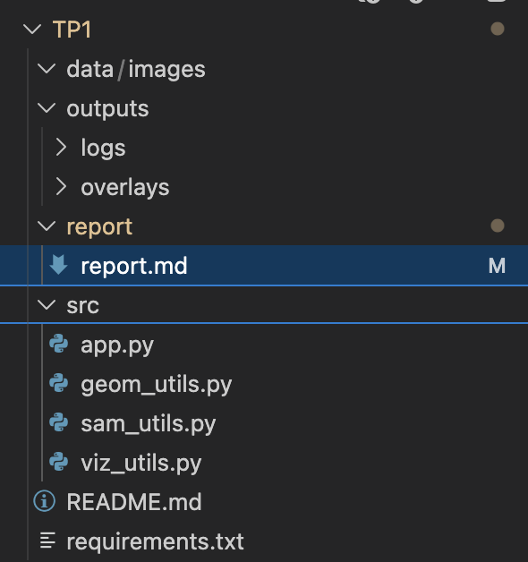

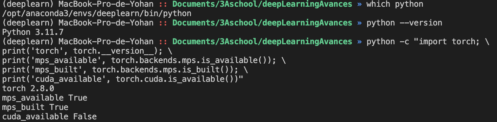

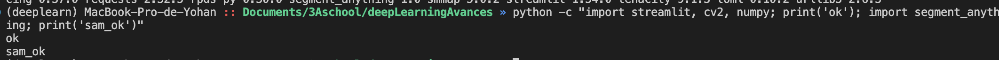

```
python -m streamlit run TP1/src/app.py --server.port $PORT --server.address 0.0.0.0
```


## Exercice 2 : Constituer un mini-dataset (jusqu’à 20 images)

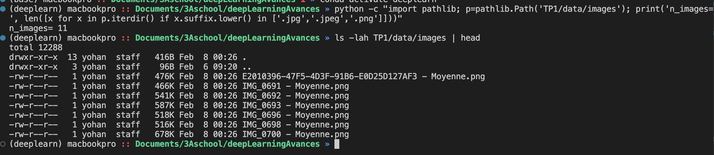
IMG_0698 - Moyenne - un goblet à travert des lunettes
    - est ce que les lunettes ou le gobelet va être detecté ?
IMG_0700 - Moyenne - un camion derrière un arbre
    - l'arbre cache une bonne partie du camion mais le camion est le sujet principal
IMG_0703 - Moyenne - deux sacs
    -  une images avec deux objets. 
IMG_0712 - Moyenne.png  - lampe trepieds fine
    - objet grand et fin.
E2010396-47F5-4D3F-91B6-E0D25D127AF3 - Moyenne - chien avec os
    - l'os est au sol, "connecté" à la bouche du chien


### cas simple : 

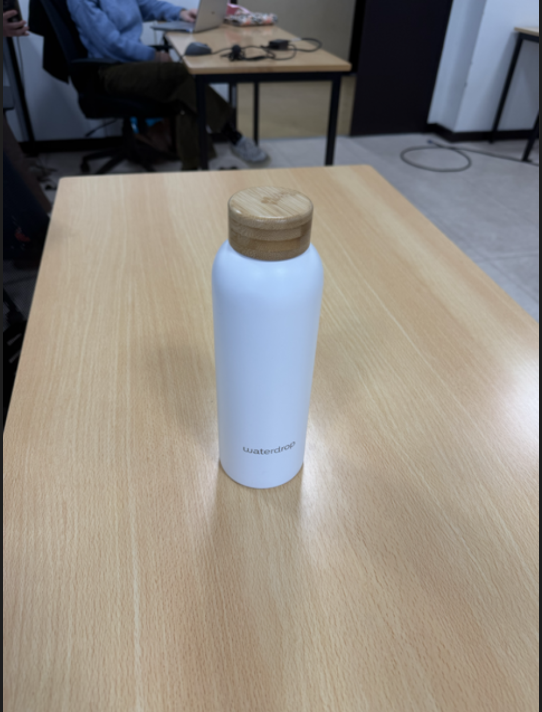

### cas difficile :
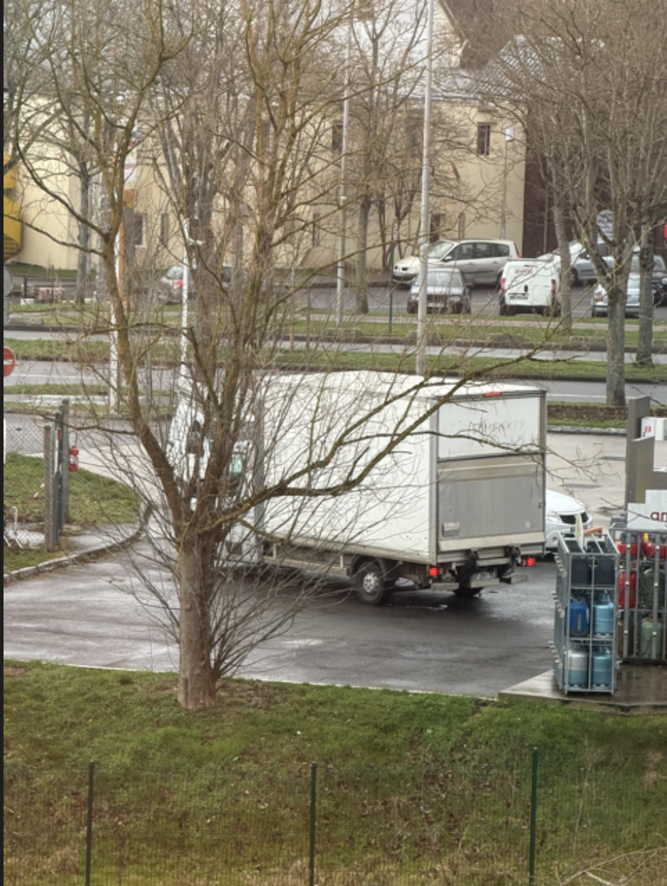


## Exercice 3 : Charger SAM (GPU) et préparer une inférence “bounding box → masque”

sam_vit_h_4b8939.pth = huge :
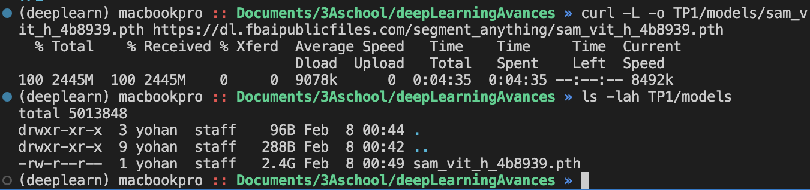

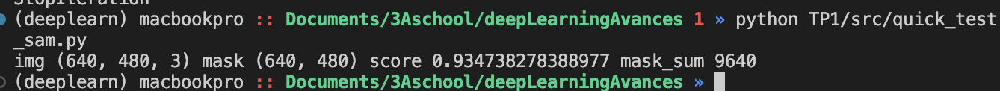

Le test fonctionne et produit un masque cohérent avec un score élevé.
Sur macOS (MPS), l’inférence reste correcte mais peut être un peu lente.

## Exercice 4 : Mesures et visualisation : overlay + métriques (aire, bbox, périmètre)

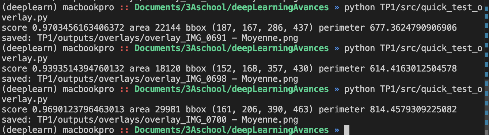

IMG_698 :
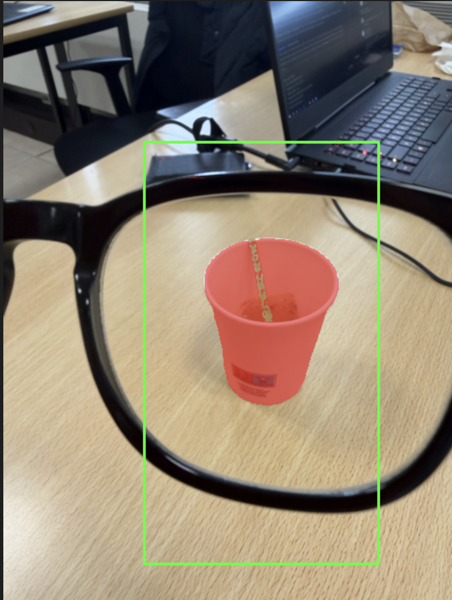

| Image | Score | Aire (px) | Périmètre |
| --- | --- | --- | --- |
| IMG_0691 - Moyenne | 0.9703 | 22144 | 677.36 |
| IMG_0698 - Moyenne | 0.9394 | 18120 | 614.42 |
| IMG_0700 - Moyenne | 0.9690 | 29981 | 814.46 |


L’overlay aide à voir si la bbox cible bien l’objet et si le masque colle au premier plan.
Il révèle vite les erreurs de prompt (bbox trop large/mal placée) et les débordements du masque.
Utile pour ajuster la bbox avant d’aller plus loin.

## Exercice 5 : Mini-UI Streamlit : sélection d’image, saisie de bbox, segmentation, affichage et sauvegarde


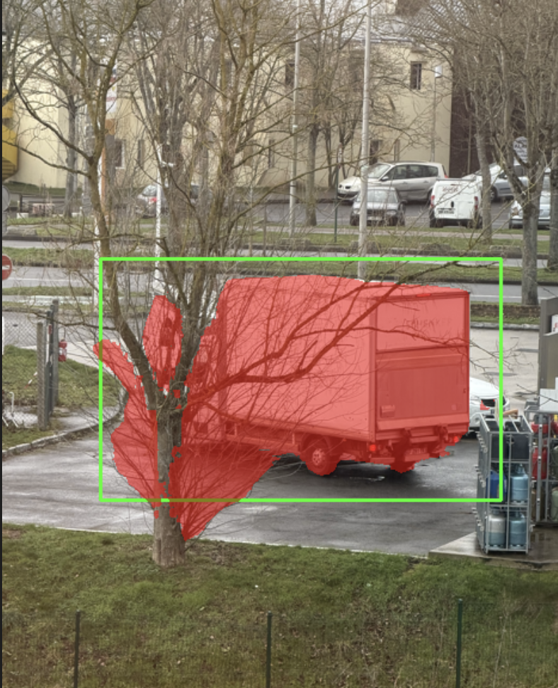

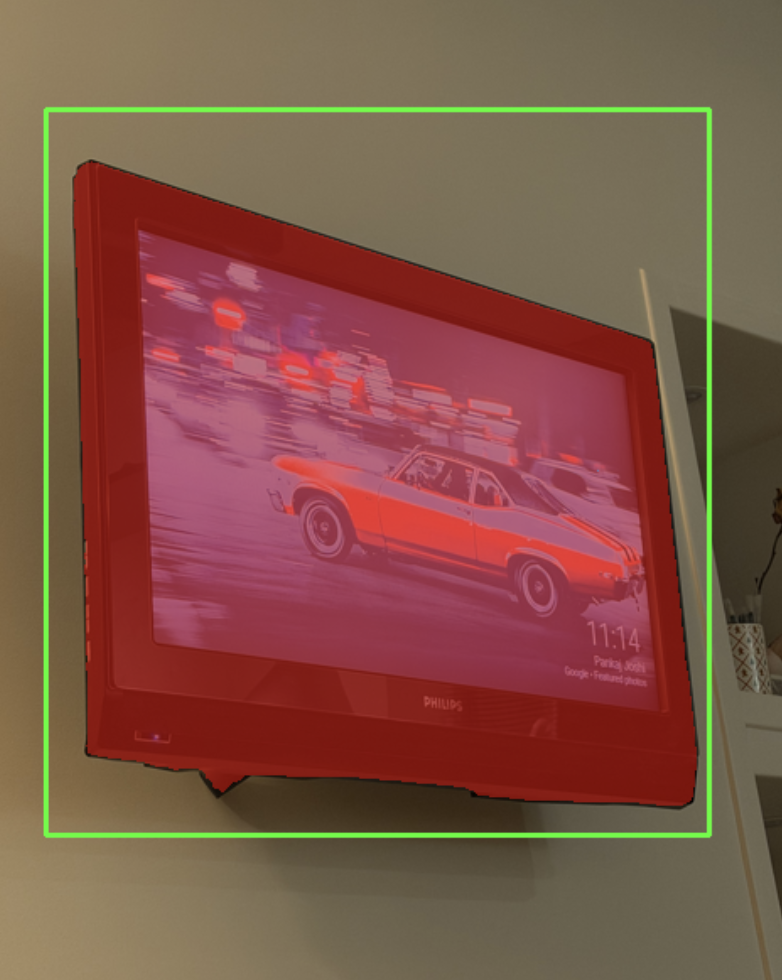

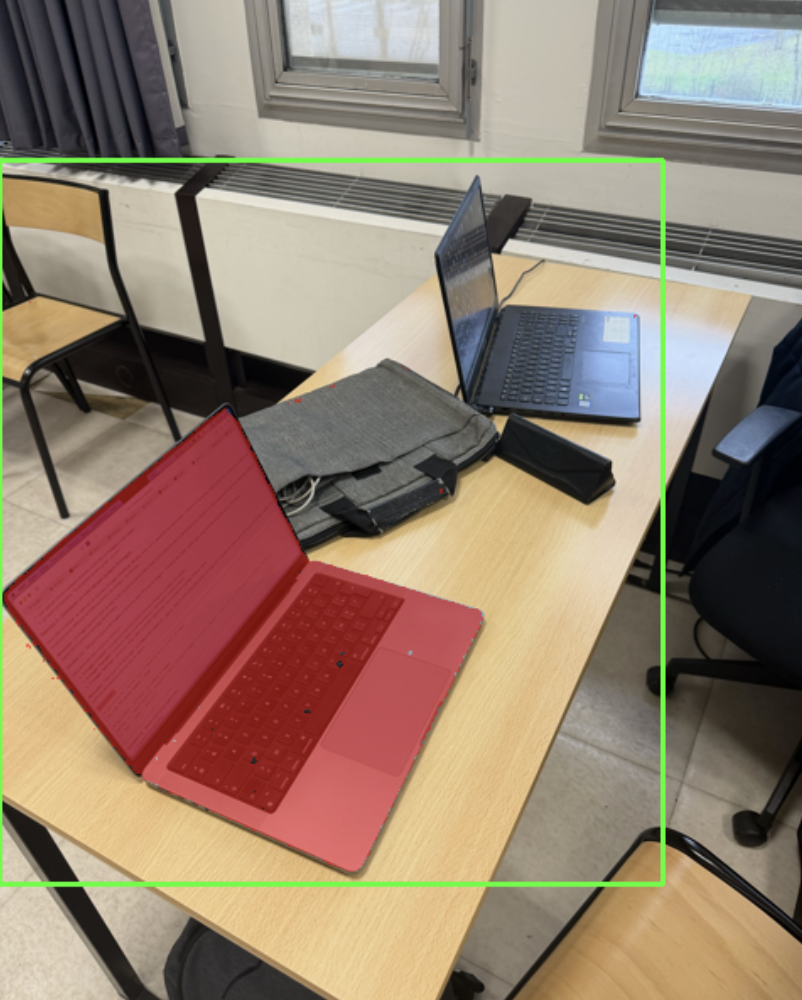

| Image | BBox (x1,y1,x2,y2) | Score | Aire (px) | Temps (ms) |
| --- | --- | --- | --- | --- |
| image-1 | (76, 267, 411, 489) | 0.9403 | 43466 | 5911.1 |
| image-2 | (48, 118, 416, 499) | 1.0105 | 110681 | 6139.8 |
| image-3 | (3, 188, 377, 525) | 0.8203 | 40669 | 5913.3 |

Quand on agrandit la bbox, SAM a plus de contexte et peut inclure des éléments de fond ou confondre l'objet qu'on veut selectionner. Quand on la rétrécit, le masque se focalise sur l’objet, mais si la bbox est trop petite, on coupe des parties et le score peut baisser.

#### exemples :
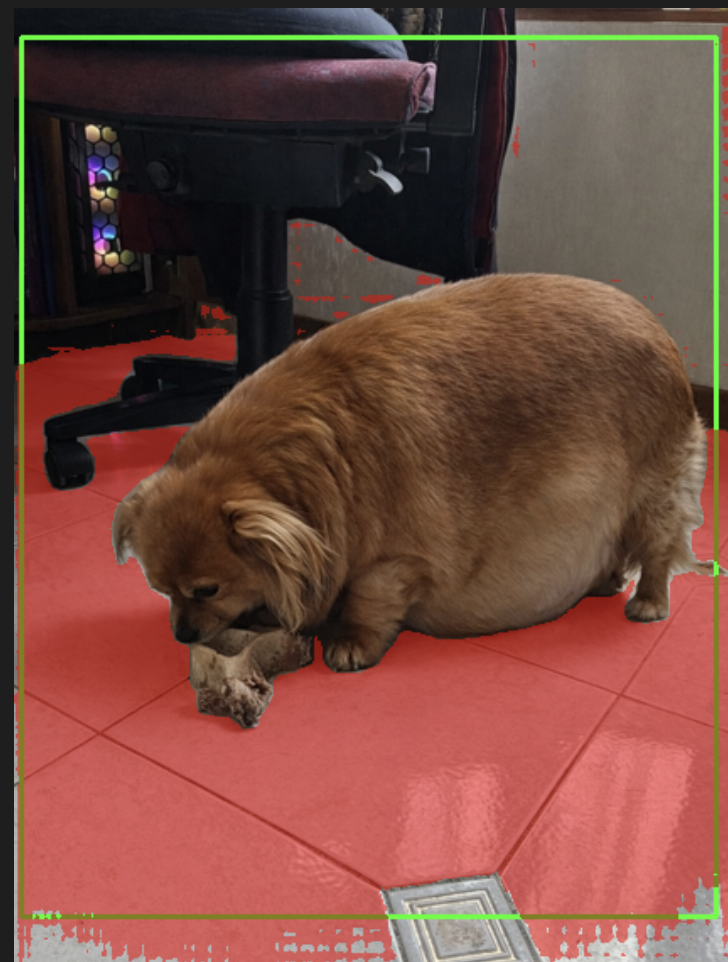
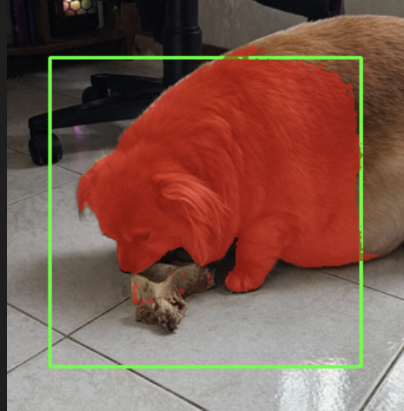

## Exercice 6 :

### Premier cas:
bbox seule, sans points (index 1) : 


avec points :

```
{
"n_points":2
    "points":[
     0:[
        0:143
        1:389
        2:0
    ]
    1:[
        0:275
        1:370
        2:1
    ]
]
}
```


index 1 :


### Deuxième cas:

bbox seule, sans points (index 2) : 


1 seul point :

resultat (index 2): 
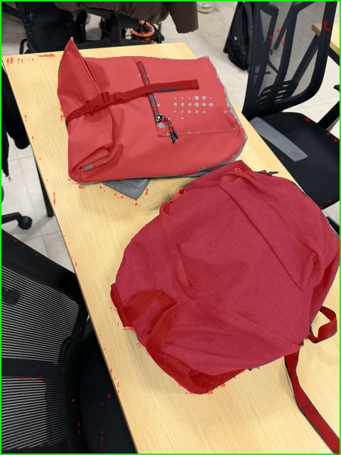

2 points :
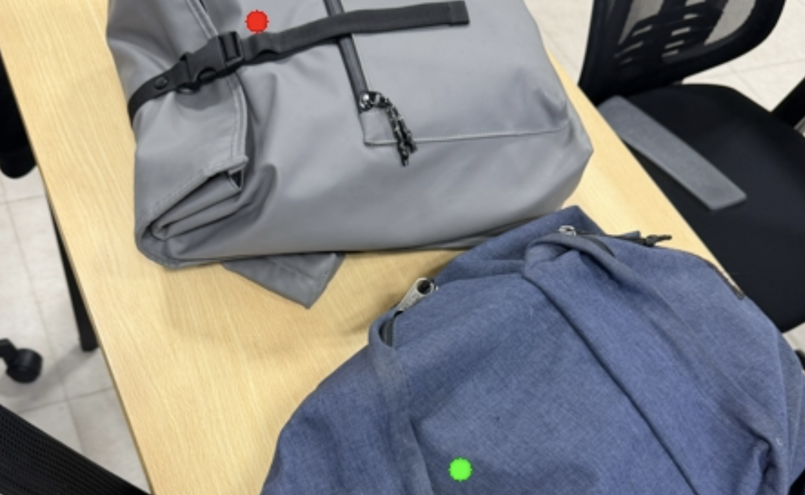
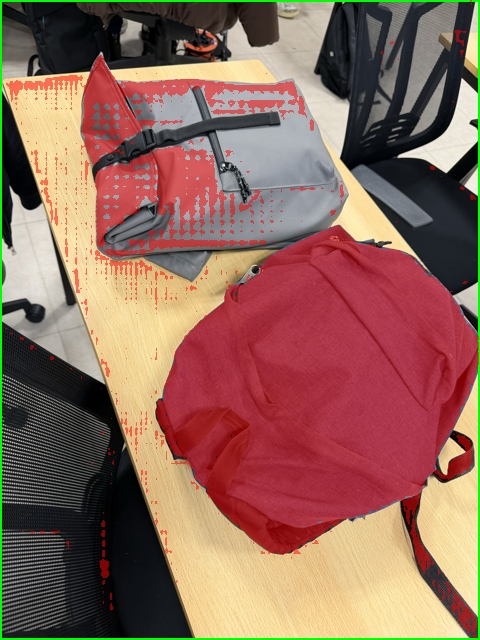

```
{
"n_points":2
    "points":[
        0:[
        0:275
        1:370
        2:1
    ]
        1:[
        0:163
        1:123
        2:0
    ]
]
}
```
Les points BG sont indispensables quand la bbox contient plusieurs objets proches. Ils permettent d’indiquer explicitement ce qui doit être exclu (arrière-plan, deuxième objet, sol). Ils sont aussi utiles pour séparer des objets collés ou partiellement superposés (arbre/camion). Malgré cela, certains cas restent difficiles, les points décalés de seulements quelques pixels peuvent tout fausser, le background/deuxième objet peut ne pas totalement être éliminé.

## Exercice 7 :

Bilan (POC vers produit) : 
1) Fond complexe et objets proches dans la bbox : SAM confond le sujet avec l’arrière-plan ou un second objet. Pour améliorer la situation on peut contraindre la bbox, ajouter des points BG/FG. 
2) Objets fins/transparents (pieds de lampe) : masque incomplet ou déchiré. 
Action : dataset dédié avec ces cas. 
3) Occlusions : contours instables, score incertain. Action : demander plusieurs vues, proposer multimask et choix utilisateur, et conserver les meilleurs candidats.


Industrialisation : je loggerais et monitorerais en priorité 1) temps d’inférence et device (CPU/MPS/CUDA) pour détecter les régressions de perf et les changement de device, 2) scores des masques et indice choisi pour suivre la confiance et repérer des ambiguïtés systématiques, 3) taille bbox et positions des points FG/BG pour corréler les erreurs avec le prompt utilisateur, 4) métriques du masque (aire, périmètre, bbox) pour détecter des sorties aberrantes (masques vides ou démesurés), 5) taux d’erreurs de chargement image/poids pour monitorer la robustesse de la pipeline 6) dérive des distributions de scores/aires dans le temps pour repérer une dégradation progressive.