# CI : Génération d'image

Yohan Delière
lien github : https://github.com/lelierre-dev/CSC8608
en local


## Exercice 1 : Mise en place & smoke test (GPU + Diffusers)

La génération activait à tort le safety trigger NSFW malgré un prompt innocent (montre).
la désactivation du safety checker n'a pas aidé, l’image restait noire.
J'ai ensuite basculé de float16 à float32 sur MPS parce que sur Apple MPS, le calcul en float16 est souvent instable avec Stable Diffusion et peut produire des NaN.

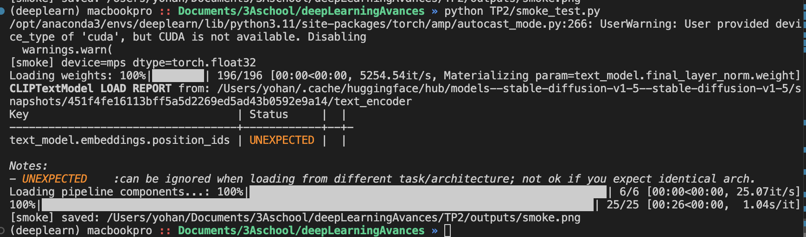

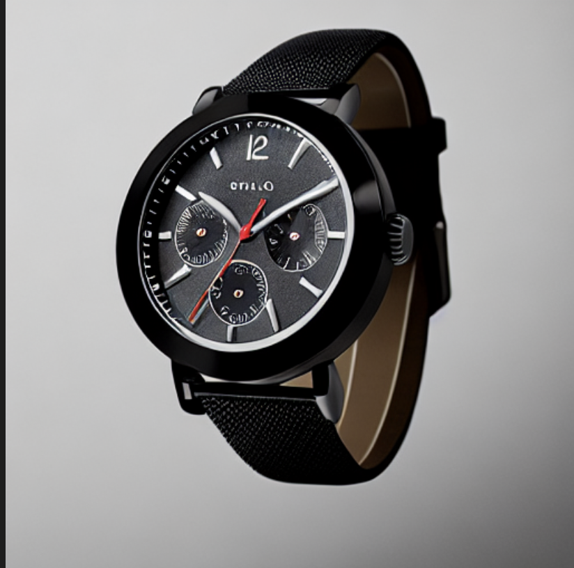

## Exercice 2 : Factoriser le chargement du pipeline (text2img/img2img) et exposer les paramètres

```
CONFIG: {'model_id': 'stable-diffusion-v1-5/stable-diffusion-v1-5', 'scheduler': 'EulerA', 'seed': 42, 'steps': 30, 'guidance': 7.5}
```
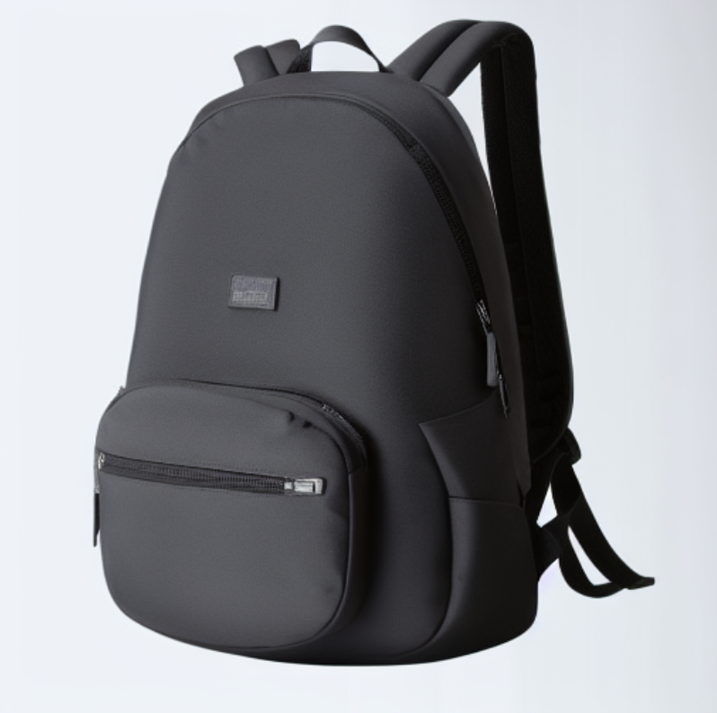

## Exercice 3 : Text2Img : 6 expériences contrôlées (paramètres steps, guidance, scheduler)

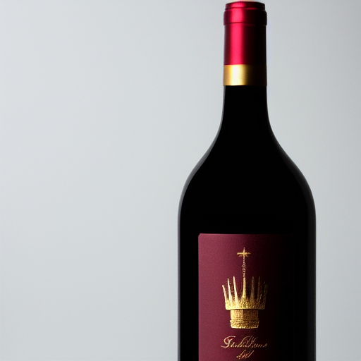
Run01 – EulerA / 30 steps / guidance 7.5 (baseline)
Rendu “packshot” propre : bouteille bien centrée, fond neutre, reflets cohérents.
Le sceau/couronne doré est lisible et “premium”.
Léger défaut : cadrage un peu serré (bouteille coupée en bas) + pseudo-texte sur l’étiquette.

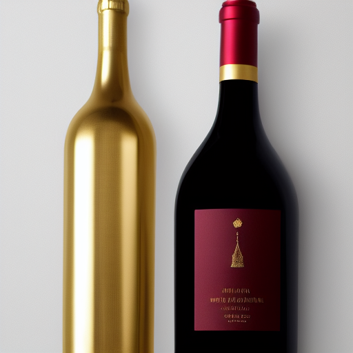
Run02 – EulerA / 15 steps / guidance 7.5
Moins stable : apparition d’une 2ème bouteille dorée (hors-prompt) + composition déséquilibrée.
Détails de l’étiquette plus “mous”, typiques d’un rendu encore “incomplet”.
Impression globale : cohérence en baisse, “drift” plus facile.

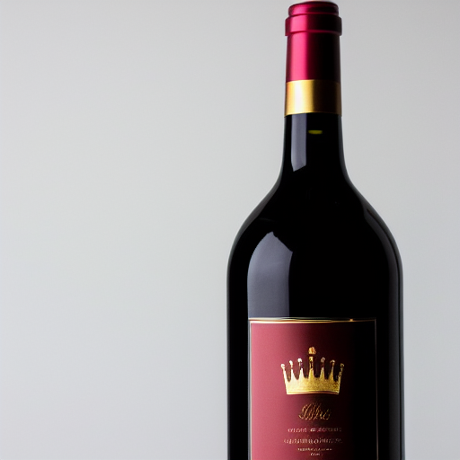
Run03 – EulerA / 50 steps / guidance 7.5
Plus “fini” : meilleurs reflets sur le verre, bords plus propres, étiquette plus nette.
Look plus premium et contrôlé (moins d’artefacts évidents).
Diminishing returns quand même : c’est surtout du polish (pas un changement radical).

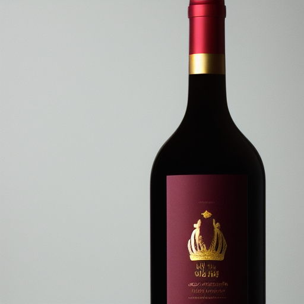
Run04 – EulerA / 30 steps / guidance 4.0
Rendu plus doux/naturel, mais moins fidèle au prompt : le sceau/couronne est moins marqué / plus “fondu”.
Détails plus timides (contraste plus faible, moins de “pop” sur le doré).
Bien pour éviter l’effet “trop forcé”, moins moins bien niveau détail.

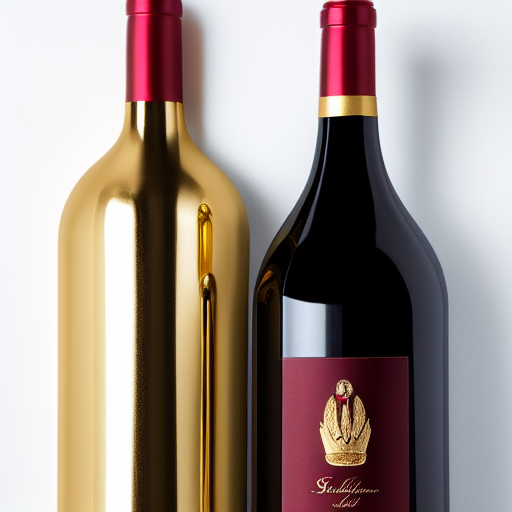
Run05 – EulerA / 30 steps / guidance 12.0
Prompt “sur-insisté” : doré très présent, contraste plus agressif, look très “luxury”.
Néanmoins 2ème bouteille + reflets/artefacts (ex. forme verticale étrange sur la bouteille or).
Guidance trop haute : plus de contrainte, plus de glitches.

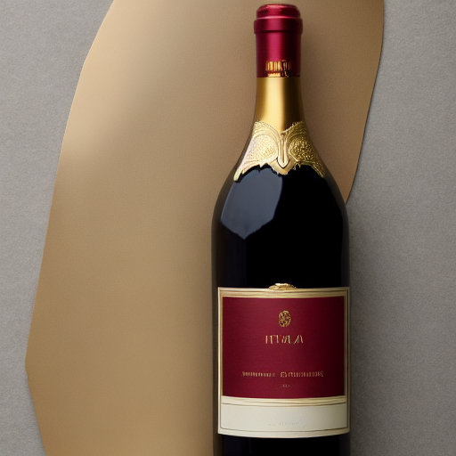
Run06 – DDIM / 30 steps / guidance 7.5
Changement de mise en scène : fond pas totalement blanc, grande forme doré derrière moins e-commerce.
Style plus "éditorial”, étiquette plus grande et plus structurée.
Globalement plus jolie, mais moins strict sur “fond blanc + produit seul”.

##### Effet des paramètres
###### Steps (15, 30, 50)
plus de steps = plus de netteté (bords, reflets, doré), meilleure cohérence locale.
Trop bas (15) = image “pas finie” + plus de drift (objets en trop).
Au-delà d’un certain point (50) = surtout du polish (gain marginal).

###### Guidance (4, 7.5, 12)
Faible (4) : plus naturel/souple, mais le prompt ressort moins (sceau/couronne moins affirmé).
Moyen (7.5) : bon compromis fidélité et réalisme.
Élevé (12) : éléments “or/premium” sur-accentués, mais risque d’artefacts et d’objets parasites.

###### Scheduler (EulerA vs DDIM)
EulerA : rendu souvent plus “punchy” et détaillé, bon pour packshot net, mais peut aussi amplifier des bizarreries quand la guidance monte.
DDIM : rendu plus “smooth” et parfois plus créatif sur la composition, mais peut s’éloigner du “fond blanc / produit seul”.

## Exercice 4 : Img2Img : 3 expériences contrôlées (strength faible/moyen/élevé)

###### Original :
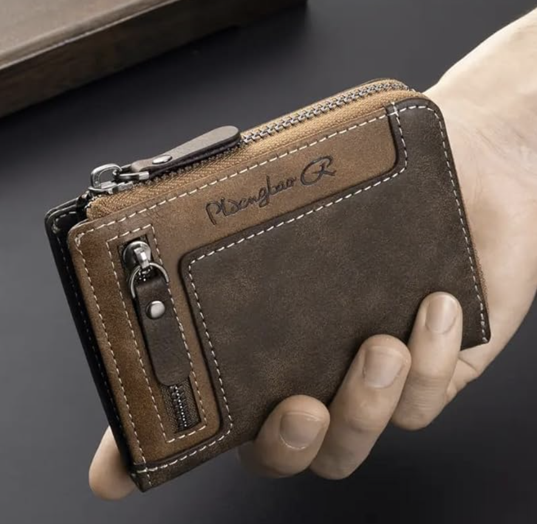

###### force 0,35 :
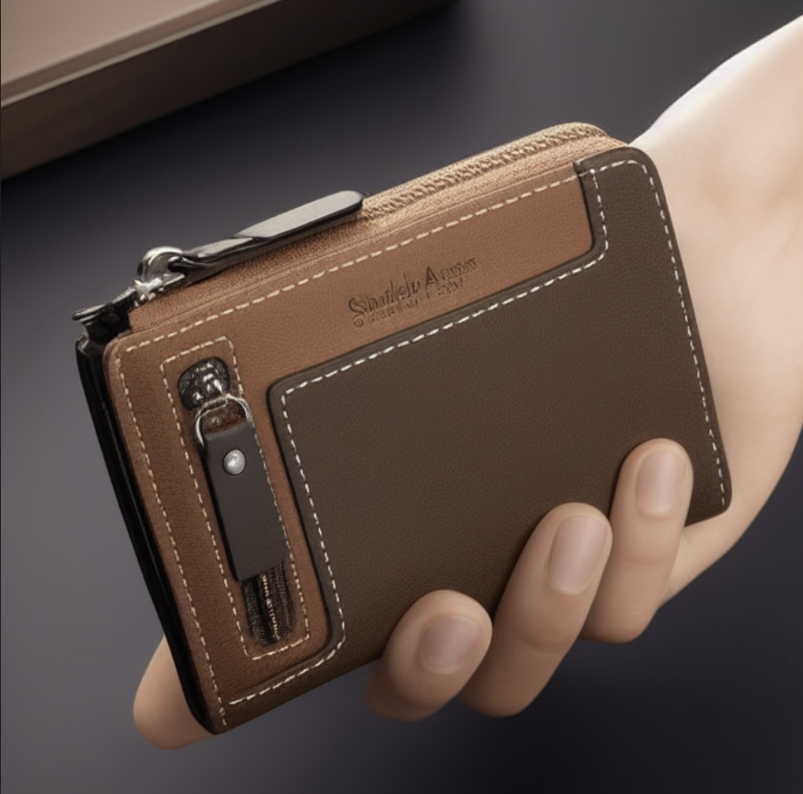

###### force 0,60 :
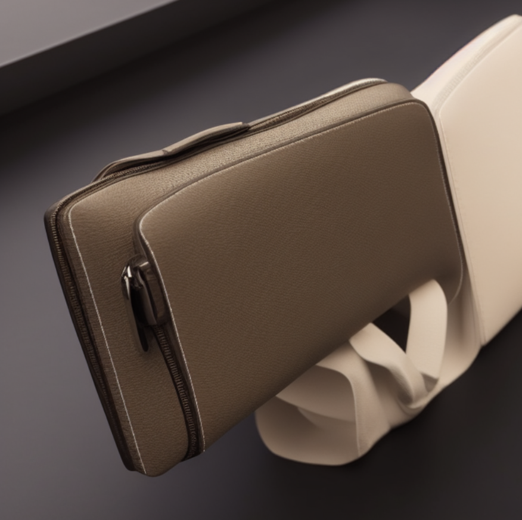

###### force 0,85 :
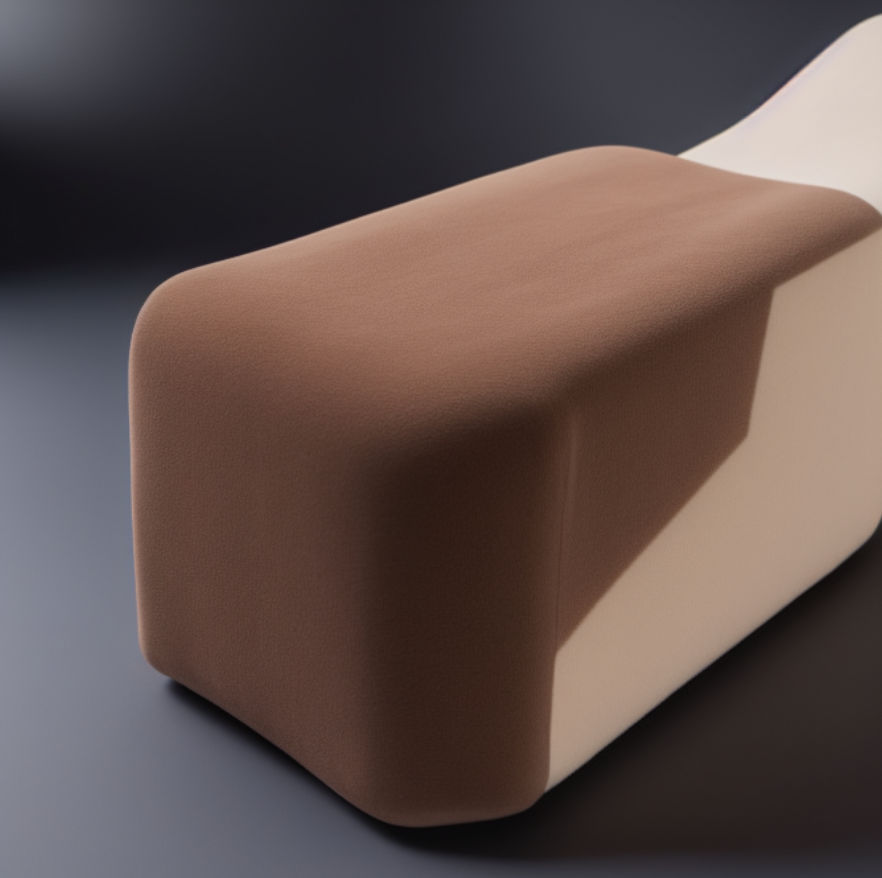


À strength = 0.35, l’identité du produit est largement préservée : forme globale, éléments distinctifs (zips, coutures) et cadrage “dans la main” restent cohérents.
Les changements portent surtout sur des textures (cuir plus lisse/synthétique), des marquages (pseudo-texte), et un éclairage légèrement plus uniforme, tandis que l’arrière-plan sombre reste quasi inchangé.
En e-commerce, ce réglage est relativement utilisable pour rester fidèle au produit, mais non conforme à un packshot “fond blanc” demandé dans le prompt.

À strength = 0.60, certains attributs (teinte brune, présence d’un zip) subsistent, mais l’identité produit commence à dériver fortement : forme beaucoup moins fidèle, détails clés effacés, et main altéré.
Les variations deviennent structurelles : arrière-plan décoratif, rendu "mauvaise 3D”, et perte de caractéristiques propres au modèle initial.
En e-commerce, le risque est déjà inacceptable pour une image de cette complexité.

À strength = 0.85, la conservation est minimale (principalement une couleur proche), tandis que la forme, les détails et la scène sont remplacés.
Les textures se simplifient et l’objet devient visuellement différent, rendant la sortie inutilisable pour une fiche produit.

En conclusion, à faible strength, l’objet reste correct mais le fond blanc n’est pas atteint. à fort strength, la scène change davantage mais le modèle altère aussi l’objet.

## Exercice 5 : Mini-produit Streamlit (MVP) : Text2Img + Img2Img avec paramètres
##### Text2Img (headphones): 
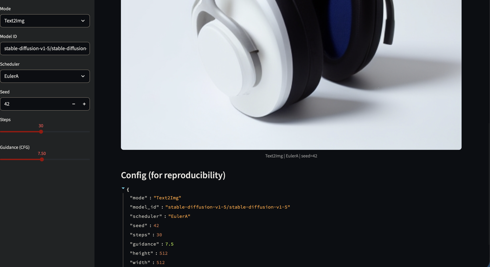

##### Img2Img (gourde): 
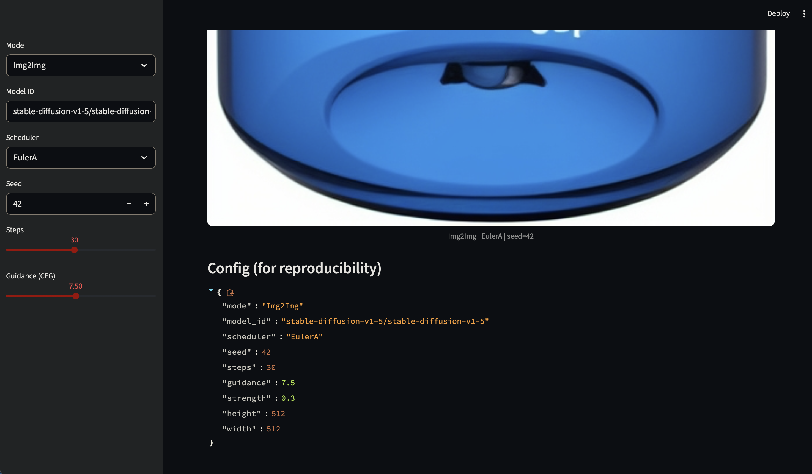
(n'a pas changé la couleur)

## Exercice 6 : Évaluation (léger) + réflexion 


##### grille d’évaluation “light” : 

- Prompt adherence (0–2)
- Visual realism (0–2)
- Artifacts (0–2) — 2 = aucun artefact gênant
- E-commerce usability (0–2) — 2 = publiable après retouches mineures
- Reproducibility (0–2) — 2 = paramètres suffisants pour reproduire

###### text2img baseline :
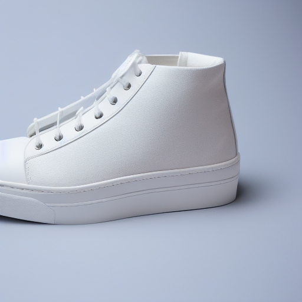
Prompt:
ultra-realistic product photo of a clean white sneaker with subtle stitching, side view, centered, isolated on a seamless pure white background, studio softbox lighting, soft shadow under the product, very sharp, commercial packshot, 85mm lens

- Prompt adherence : 1, non centré 
- Visual realism : 2, beau détails 
- Artifacts : 2 = aucun artefact gênant
- E-commerce usability (0) = non centré
- Reproducibility : 2 = même resultat avec même prompt

total : 7/10

######  text2img avec un paramètre “extrême” (steps = 60) :
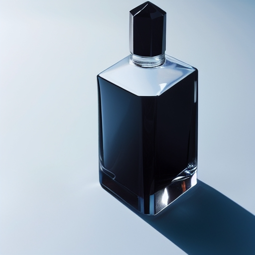
Prompt:
ultra-realistic high-end product photo of a transparent glass perfume bottle with a glossy black cap, crisp edges, realistic refractions and reflections, centered, isolated on a seamless pure white background, professional studio lighting, soft shadow, extremely sharp,commercial packshot 

- Prompt adherence : 1, non centré 
- Visual realism : 2, très beau détails, reflets, ombre
- Artifacts : 2 = aucun artefact gênant
- E-commerce usability (2) = à recentrer manuellement 
- Reproducibility : 2 = même resultat avec même prompt

total : 9/10


######  une img2img à strength élevé :

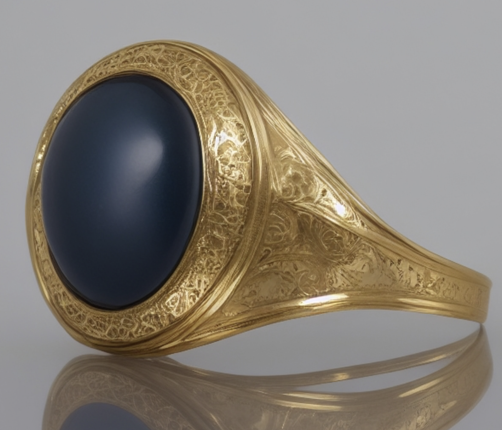

Prompt:
"white background"
image originale :
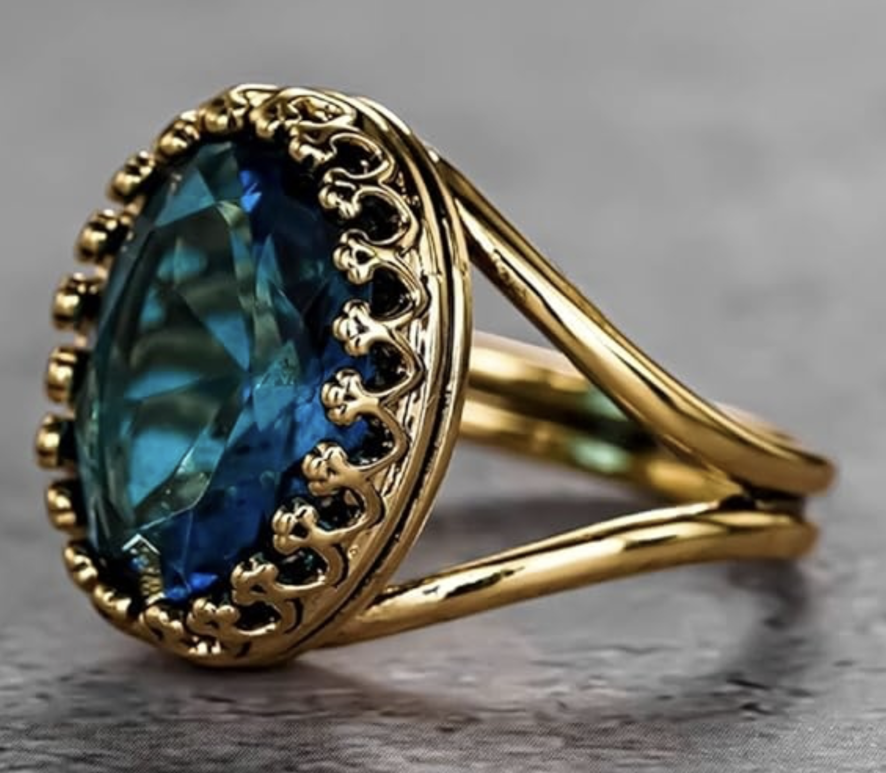

- Prompt adherence : 1, objet different mais le fond est bien changé  
- Visual realism : 1, effet mauvaise 3D.
- Artifacts : 1 = reflet incohérent
- E-commerce usability 0 = inutilisable
- Reproducibility : 2 = même resultat avec même prompt

total : 5/10

##### réflexion
Dans ce TP, on observe le compromis quality vs latency et cost. Augmenter num_inference_steps 15 -> 30 -> 50 améliore la netteté et la stabilité des détails, mais les gains deviennent vite décroissants alors que le temps de génération augmente presque linéairement. Le scheduler influence aussi le style, avec EulerA plus “punchy” et DDIM plus “smooth” mais parfois moins strict sur la composition, donc on choisit selon l’objectif e-commerce ou créatif. La reproductibilité exige au minimum model_id, scheduler, seed avec device et generator, steps, guidance_scale, height/width, prompt et negative prompt. Elle peut casser si on change la version du modèle, le scheduler, le backend CPU/CUDA/MPS, la précision fp32 ou certaines versions de librairies. Enfin, en e-commerce, les risques sont importants. Le modèle peut halluciner des éléments, produire du pseudo-texte ou des logos inventés, et générer des images trompeuses. En img2img, on l’a vu avec strength=0.85 où le produit dérive trop et ne correspond plus au portefeuille initial. Pour limiter ces risques, je privilégierais des pipelines contraints rappelant l’inpainting du fond plutôt qu’une transformation globale, avec un strength bas, des prompts explicites “no hands” et “isolated”, et des contrôles humains plus une vérification de cohérence avec la photo source.