# CI : Deep learning pour audio

Yohan Delière
lien github : https://github.com/lelierre-dev/CSC8608
en local


## Exercice 1 : Initialisation du TP3 et vérification de l’environnement
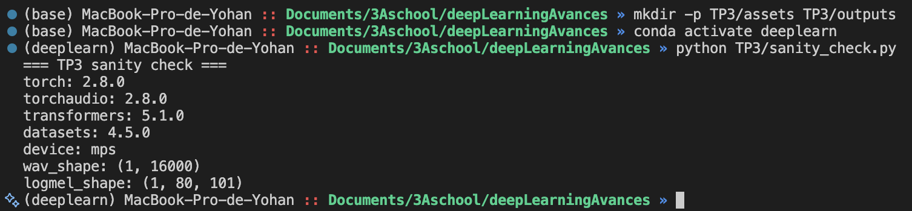

## Exercice 2 : Constituer un mini-jeu de données : enregistrement d’un “appel” (anglais) + vérification audio

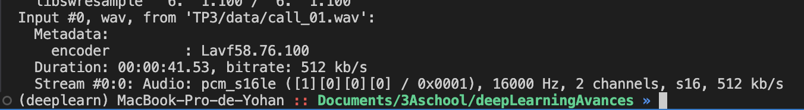

Il y a deux channels donc on converti en mono

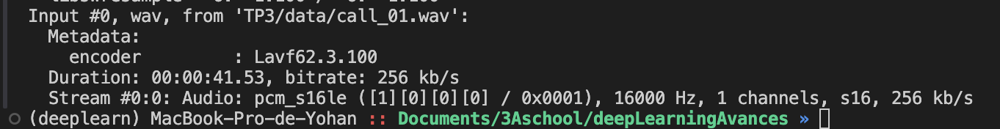

python TP3/inspect_audio.py


## Exercice 3 : VAD (Voice Activity Detection) : segmenter la parole et mesurer speech/silence

python TP3/vad_segment.py
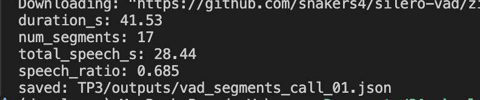

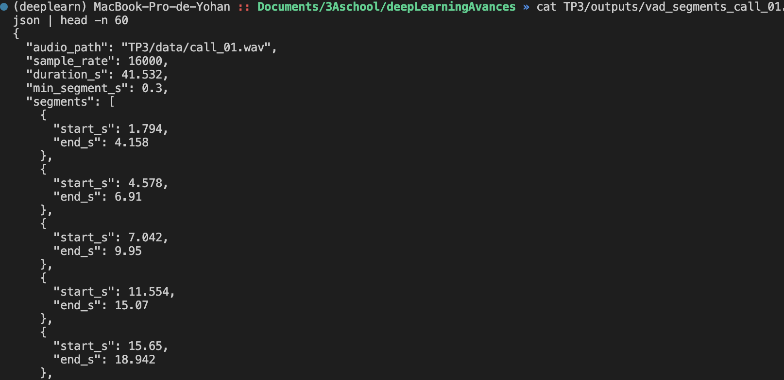

Le ratio speech/silence observe semble coherent avec une lecture continue ponctuee de petites pauses et respirations.
Je remarque quelques micro-segments, surtout entre 22.4 s et 26.9 s, mais pas d'explosion du nombre de segments, donc un VAD raisonnablement sensible.
Pas de segments anormalement longs qui engloberait de grands silences, ce qui va dans le bon sens.

En augmentant min_dur_s de 0,3 a 0,5 on observe que le nombre de segment diminue de 17 a 15, car le post filtrage supprime les segments dont la duree est comprise entre 0,3 s et 0,5 s, qui etaient auparavant conserves.

total_speech_s diminue (28.44 -> 27.62) 
donc le ratio baisse mecaniquement (0.685 -> 0.665)

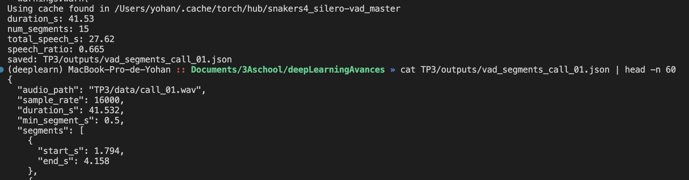


## Exercice 4 : ASR avec Whisper : transcription segmentée + mesure de latence

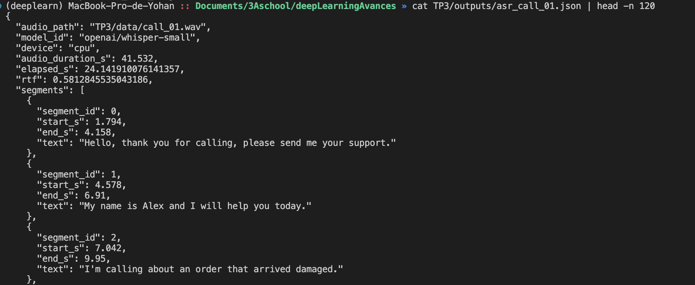

 la segmentation VAD semble trop courte et gêne la transcription quand on enumère les caractères de la commande, on est très rapide et il semblerait que l'on manque un chiffre (3) qui devrait etre entre le segment id 9 et 10.

## Exercice 5 : Call center analytics : redaction PII + intention + fiche appel
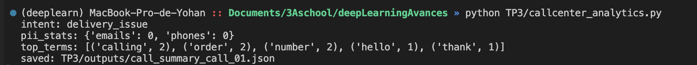

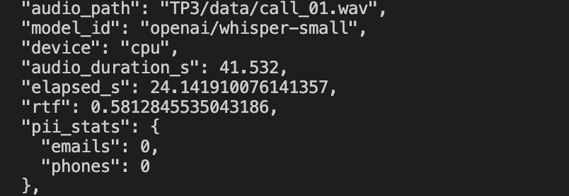
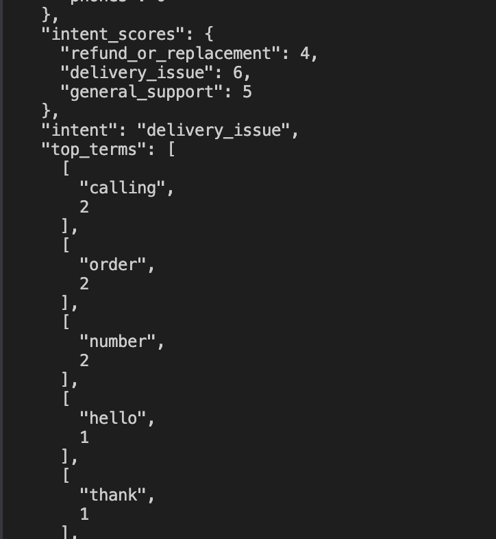
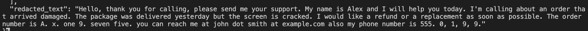


Après l'update du post-traitement :
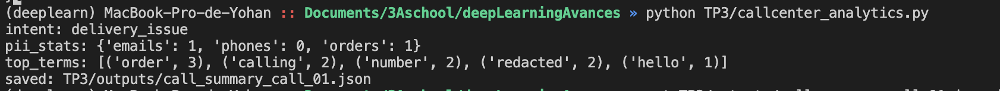

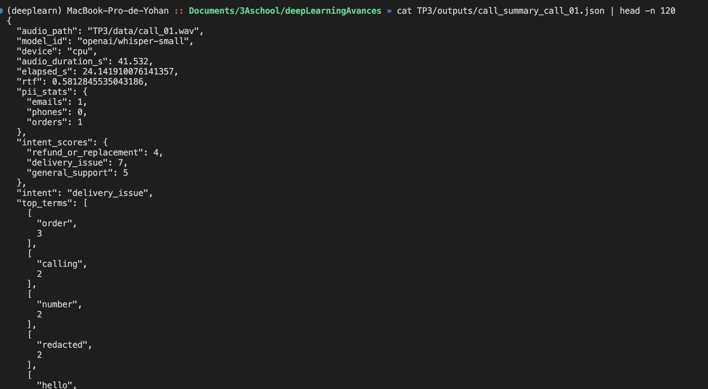
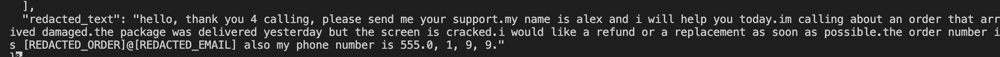

Avant post-traitement, l'intention reste delivery_issue mais aucune PII n est detectee (emails=0, phones=0) et le texte est brut. Apres post-traitement, l intention reste la meme mais la detection PII s ameliore nettement avec emails=1 et orders=1 (apparition de redacted dans les top terms), tandis que le telephone reste non detecte (phones=0).

Les erreurs les plus critiques sont celles qui touchent des mots-cles de routage et les motifs PII, pas les politesses. Un mot mal transcrit ou absent peut faire basculer l intention (ex: si “refund” ou “replacement” est rate, on peut router vers “general_support” au lieu du service retours). Sur la PII, Whisper epele souvent les numeros (“A. x. one 9…”) et separe les chiffres (“555. 0, 1, 9, 9.”), ce qui casse les regex si elles ne gerent pas ces formats. Exemple concret observe: le telephone n est pas detecte (phones=0) alors qu il est present, car chiffres avec virgules + longueur courte. A l inverse, la normalisation dot/at rend l email detecte (emails=1), donc le post-traitement peut compenser une transcription “parlee”. En produit, rater une intention “refund” est bien plus grave qu une faute sur “thank you”, car ca change une decision de routage et l experience client.

## Exercice 6 : TTS léger : générer une réponse “agent” et contrôler latence/qualité

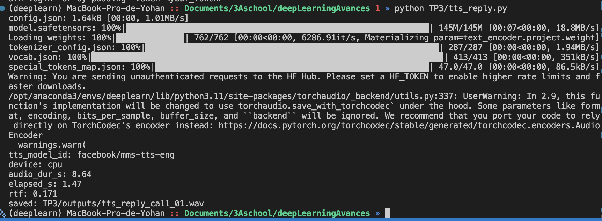
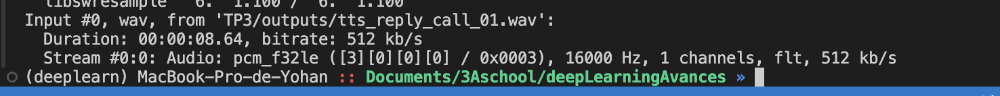

Prononciation globalement correcte et message intelligible, le contenu reste facile a comprendre. En revanche, la prosodie est monotone et le debit est tres rapide, avec tres peu de pauses entre les mots, ce qui donne un rendu un peu robotique. Je n ai pas observe de grosses coupures, mais le rythme peut fatiguer a l ecoute. Cote latence, le RTF (environ 0.17) indique une synthese nettement plus rapide que le temps reel, donc compatible avec un usage live.

#### Evaluation de la réponse :

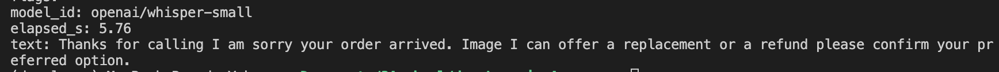

Comme cité auparavant, le rythme est peut etre un peu trop rapide et monotone pour que Whisper-small ait de bonnes performances.

## Exercice 7 : Intégration : pipeline end-to-end + rapport d’ingénierie (léger)

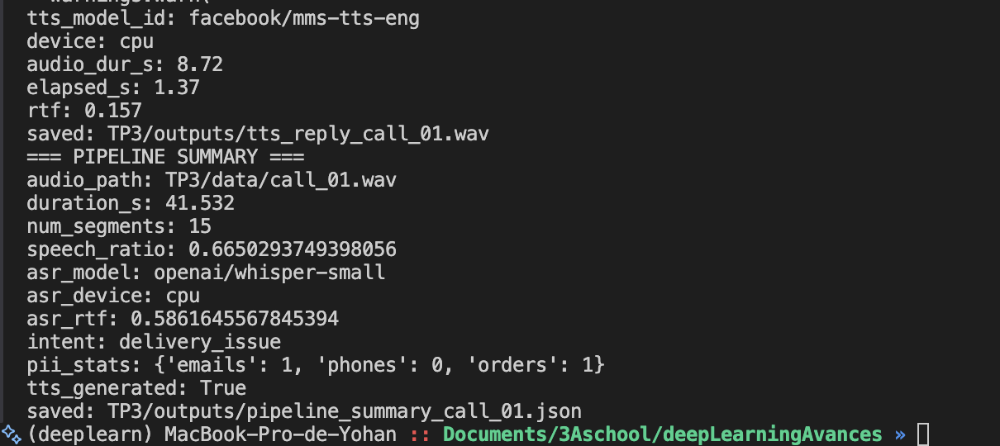
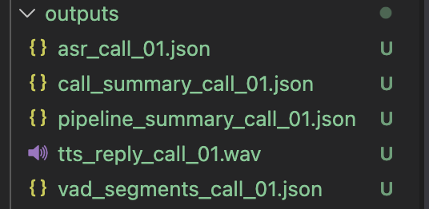

```
(deeplearn) MacBook-Pro-de-Yohan :: Documents/3Aschool/deepLearningAvances » cat TP3/outputs/pipeline_summary_call_01.json
{
  "audio_path": "TP3/data/call_01.wav",
  "duration_s": 41.532,
  "num_segments": 15,
  "speech_ratio": 0.6650293749398056,
  "asr_model": "openai/whisper-small",
  "asr_device": "cpu",
  "asr_rtf": 0.5861645567845394,
  "intent": "delivery_issue",
  "pii_stats": {
    "emails": 1,
    "phones": 0,
    "orders": 1
  },
  "tts_generated": true
}% 

```

Engineering note:
Le goulet d'etranglement temps est clairement l'ASR Whisper (RTF d'environ 0.59), loin devant VAD et analytics.
La partie la plus fragile en qualite est la segmentation + ASR sur chiffres/PII, car une coupure VAD ou une transcription ratee casse les regex.
Les emails et numeros epeles restent difficiles et le moindre mot-cle manquant peut changer l'intention.
Amelioration 1: mieux normaliser le texte (dot/at, digits isoles, separation chiffres-lettres) avant analytics.
Amelioration 2: calibrer le VAD (min_dur, padding, merge) pour eviter micro-segments et mieux couvrir les digits epeles.