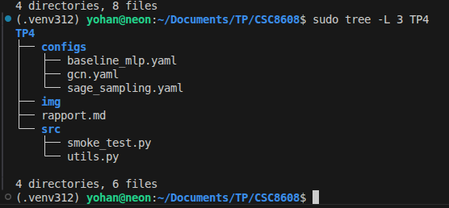
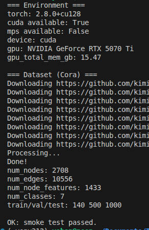
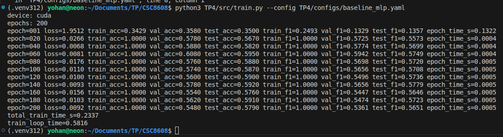

# CI : Graph Neural Networks

Yohan Delière
lien github : https://github.com/lelierre-dev/CSC8608
en local

## Exercice 1 : Initialisation du TP et smoke test PyG (Cora)

#### smoke test 

## Exercice 2 : Baseline tabulaire : MLP (features seules) + entraînement et métriques

## Exercice 3 : Baseline GNN : GCN (full-batch) + comparaison perf/temps

## Exercice 4 : Modèle principal : GraphSAGE + neighbor sampling (mini-batch)

## Exercice 5 : Benchmarks ingénieur : temps d’entraînement et latence d’inférence (CPU/GPU)

## Exercice 6 : Synthèse finale : comparaison, compromis, et recommandations ingénieur