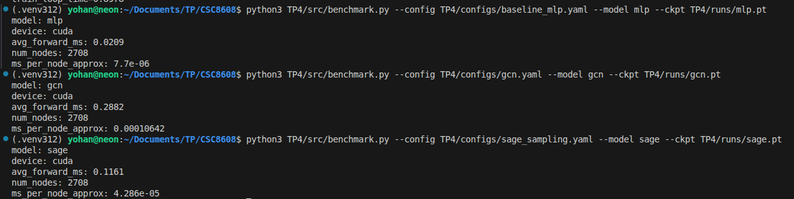

# CI : Graph Neural Networks

Yohan Delière
lien github : https://github.com/lelierre-dev/CSC8608
en local


## Exercice 1 : Initialisation du TP et smoke test PyG (Cora)


#### smoke test 


## Exercice 2 : Baseline tabulaire : MLP (features seules) + entraînement et métriques

On calcule séparément les métriques sur train_mask, val_mask et test_mask pour suivre le modèle proprement à chaque étape. Le score sur train_mask montre s’il apprend bien sur les données vues pendant l’entraînement. Le score sur val_mask sert à comparer les réglages sans biaiser l’évaluation finale. Le score sur test_mask est gardé à la fin pour estimer le vrai niveau du modèle sur des données jamais utilisées. Cette séparation évite de se tromper sur les performances réelles.


## Exercice 3 : Baseline GNN : GCN (full-batch) + comparaison perf/temps

### execution MLP

``` 
(.venv312) yohan@neon:~/Documents/TP/CSC8608$ python3 TP4/src/train.py --config TP4/configs/baseline_mlp.yaml --model mlp
device: cuda
model: mlp
epochs: 200
epoch=001 loss=1.9512 train_acc=0.3429 val_acc=0.3580 test_acc=0.3500 train_f1=0.2493 val_f1=0.1329 test_f1=0.1357 epoch_time_s=0.1358
...
epoch=200 loss=0.0092 train_acc=1.0000 val_acc=0.5480 test_acc=0.5790 train_f1=1.0000 val_f1=0.5361 test_f1=0.5651 epoch_time_s=0.0004
total_train_time_s=0.2404
train_loop_time=0.6006
```

### execution GCN

``` 
(.venv312) yohan@neon:~/Documents/TP/CSC8608$ python3 TP4/src/train.py --config TP4/configs/gcn.yaml --model gcn
device: cuda
model: gcn
epochs: 200
epoch=001 loss=1.9490 train_acc=0.8786 val_acc=0.5440 test_acc=0.5530 train_f1=0.8740 val_f1=0.5529 test_f1=0.5657 epoch_time_s=0.1618
...
epoch=200 loss=0.0086 train_acc=1.0000 val_acc=0.7600 test_acc=0.8040 train_f1=1.0000 val_f1=0.7436 test_f1=0.7940 epoch_time_s=0.0008
total_train_time_s=0.3379
train_loop_time=0.7454
```

### Comparaison MLP vs GCN

Le MLP obtient `0.5790` en `test_acc` et `0.5651` en `test_f1`, contre `0.8040` et `0.7940` pour le GCN.  
Le GCN fait donc nettement mieux sur Cora, avec un temps d’entraînement seulement un peu plus élevé.

| modèle | test_acc | test_f1 | temps |
|---|---:|---:|---:|
| MLP | 0.5790 | 0.5651 | 0.2404 s |
| GCN | 0.8040 | 0.7940 | 0.3379 s |

Sur Cora, le GCN peut dépasser le MLP car il exploite non seulement les features des nœuds, mais aussi le signal du graphe via le voisinage.  
Ce signal relationnel est utile quand des noeuds connectés appartiennent souvent à des classes proches, ce qui correspond à une forme d’homophilie.  
Les voisins apportent donc de l’information supplémentaire que le MLP ignore complètement.  
Le GCN réalise ainsi un lissage local des représentations, ce qui aide à mieux classer des nœuds ambigus.  
Ici, ce mécanisme semble très bénéfique, car l’écart avec le MLP est large sur `test_acc` et `test_f1`.  
Mais si les features seules étaient déjà très discriminantes, le gain du graphe pourrait être beaucoup plus faible.  
Un lissage trop fort pourrait aussi devenir négatif si des voisins de classes différentes se mélangent trop.  
Dans ce test le graphe de Cora apporte clairement une information utile que le MLP ne capture pas.

## Exercice 4 : Modèle principal : GraphSAGE + neighbor sampling (mini-batch)

### execution GraphSAGE

``` 
(.venv312) yohan@neon:~/Documents/TP/CSC8608$ python3 TP4/src/train.py --config TP4/configs/sage_sampling.yaml --model sage
device: cuda
model: sage
epochs: 200
epoch=001 loss=1.9474 train_acc=0.9714 val_acc=0.6820 test_acc=0.7060 train_f1=0.9710 val_f1=0.6387 test_f1=0.6686 epoch_time_s=0.1184
...
epoch=200 loss=0.0036 train_acc=1.0000 val_acc=0.7800 test_acc=0.8070 train_f1=1.0000 val_f1=0.7727 test_f1=0.8009 epoch_time_s=0.0013
total_train_time_s=0.4085
train_loop_time=0.8553
```

### Comparaison MLP, GCN, GraphSAGE

Le MLP est nettement en dessous des deux modèles de graphe sur Cora.  
Le GCN et GraphSAGE obtiennent des performances très proches, avec un léger avantage final pour GraphSAGE en `test_f1`.  
GraphSAGE est aussi le plus lent des trois dans cette expérience.  


| modèle | test_acc | test_f1 | temps |
|---|---:|---:|---:|
| MLP | 0.5790 | 0.5651 | 0.2404 s |
| GCN | 0.8040 | 0.7940 | 0.3379 s |
| GraphSAGE | 0.8070 | 0.8009 | 0.4085 s |

Le neighbor sampling accélère l’entraînement parce qu’on ne traite pas tout le graphe à chaque itération. On prend un mini-batch de nœuds, puis seulement un nombre limité de voisins à chaque couche selon le fanout. Cela réduit le coût mémoire et calcul, donc c’est plus scalable sur de grands graphes. Mais on ne voit qu’une partie du voisinage à chaque passage, donc le gradient est plus bruité Le modèle apprend avec une information moins complète qu’en full-batch. Si le fanout est trop petit, on peut manquer des voisins utiles et perdre en performance. C’est encore plus visible avec des hubs, car ces nœuds ont beaucoup de voisins potentiellement importants. Si on augmente le fanout, on récupère un meilleur signal, mais le coût de calcul augmente aussi. Il faut aussi compter le coût CPU du sampling, qui n’est pas gratuit (dans notre cas, Cora est petit, donc le GCN full-batch coûte déjà très peu et l’overhead du sampling/loader peut au final rendre GraphSAGE un peu plus lent). Le compromis est simple : moins de voisins = plus rapide mais plus de variance, plus de voisins = plus stable mais plus coûteux.

## Exercice 5 : Benchmarks ingénieur : temps d’entraînement et latence d’inférence (CPU/GPU)




| modèle | test_acc | test_f1 | total_train_time_s | avg_forward_ms |
|---|---:|---:|---:|---:|
| MLP | 0.5790 | 0.5651 | 0.2374 | 0.0209 |
| GCN | 0.8040 | 0.7940 | 0.3468 | 0.2882 |
| GraphSAGE | 0.8070 | 0.8009 | 0.4313 | 0.1161 |


On fait un warmup pour éviter de mesurer les premiers forwards, qui sont souvent plus lents que les suivants.
Au début, il peut y avoir des coûts de lancement, d’allocation mémoire ou d’initialisation côté GPU.
Si on mesure directement sans warmup, les temps sont moins représentatifs du vrai coût moyen du modèle.
On synchronise CUDA avant et après la mesure parce que les opérations GPU sont asynchrones.
Ça veut dire que Python peut continuer alors que le GPU n’a pas encore fini le calcul.
Sans synchronisation, le timer peut s’arrêter trop tôt et donner un temps faux.
La synchronisation force donc le CPU à attendre que le GPU ait vraiment terminé.
Ça permet d’obtenir des mesures plus stables et plus proches du vrai temps de forward.

## Exercice 6 : Synthèse finale : comparaison, compromis, et recommandations ingénieur


## Synthèse finale

| Modèle      | test_acc | test_macro_f1 | total_train_time_s | train_loop_time | avg_forward_ms |
|------------|----------|---------------|--------------------|----------------|----------------|
| MLP        | 0.5790   | 0.5651        | 0.2374             | 0.6145         | 0.0209         |
| GCN        | 0.8040   | 0.7940        | 0.3468             | 0.7648         | 0.2882         |
| GraphSAGE  | 0.8070   | 0.8009        | 0.4313             | 0.8978         | 0.1161         |


Sur ce TP, je choisirais le MLP seulement si la contrainte principale est le coût d’inférence et la simplicité.  
Il a de très loin la plus faible latence (`0.0209 ms`), mais sa qualité est aussi nettement plus faible avec `0.5790` en test accuracy et `0.5651` en macro-F1.  
Si le graphe est petit, disponible en entier et assez stable, le GCN me paraît être le choix le plus simple côté production.  
Il apporte un gros gain de qualité par rapport au MLP (`0.8040` en test accuracy) pour un coût d’entraînement encore raisonnable (`0.3468 s`).  
GraphSAGE obtient les meilleurs scores (`0.8070` en test accuracy et `0.8009` en macro-F1), donc c’est le meilleur choix si on veut maximiser la qualité.  
Son intérêt devient surtout clair quand le graphe devient grand ou dynamique, car le sampling permet de mieux passer à l’échelle.  
Dans nos mesures sur Cora, il reste un peu plus lent à entraîner que GCN (`0.4313 s` contre `0.3468 s`), donc son avantage n’est pas sur le coût ici.  
Sa latence d’inférence full-batch reste meilleure que celle du GCN (`0.1161 ms` contre `0.2882 ms`), ce qui est un point positif.  
Donc, sur ce TP, je retiendrais GCN comme meilleur compromis simple/efficace sur petit graphe, GraphSAGE si on anticipe un passage à plus grande échelle, et MLP seulement si le graphe n’apporte pas assez de gain pour justifier son coût.

Un risque de protocole dans ce TP est de comparer des mesures qui ne sont pas prises exactement dans les mêmes conditions.  
Par exemple, changer de seed, mesurer un modèle sur CPU et un autre sur GPU, ou oublier la synchronisation CUDA peut fausser les temps.  
Il y a aussi un risque de data leakage si on utilise mal les masques train, val et test.  
Sur un graphe, il faut aussi faire attention aux différences entre full-batch et sampling, car le coût mesuré ne correspond pas toujours au même scénario d’usage.  
Le caching, le warmup GPU ou des checkpoints déjà chargés peuvent aussi rendre certains runs artificiellement plus rapides.  
Dans un vrai projet, j’éviterais ça en fixant la seed, en gardant le même matériel pour tous les modèles, en répétant les runs plusieurs fois et en reportant une moyenne.  
Je garderais aussi un protocole de mesure unique pour l’entraînement et l’inférence, avec les mêmes données et les mêmes conditions d’exécution.

(gitignore fait)

