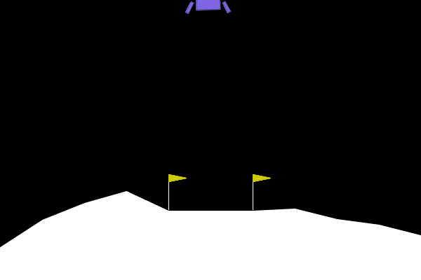
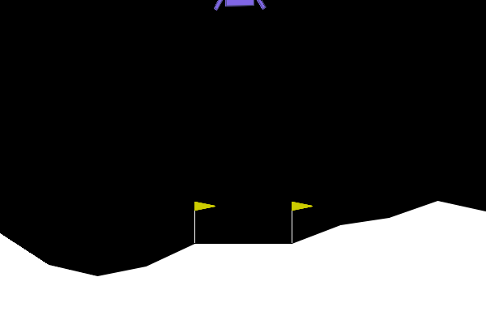
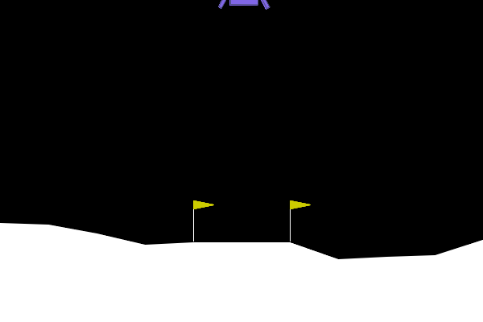
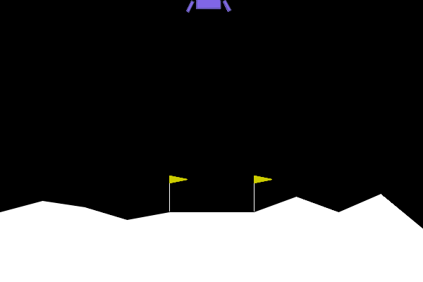

# CI : Deep Reinforcement Learning

Yohan Delière
lien github : https://github.com/lelierre-dev/CSC8608
en local


## Exercice 1 : Comprendre la Matrice et Instrumenter l'Environnement (Exploration de Gymnasium)



``` 
(.venv312) yohan@neon:~/Documents/TP/CSC8608$ python3 TP5/random_agent.py
Espace d'observation (Capteurs) : Box([ -2.5        -2.5       -10.        -10.         -6.2831855 -10.
  -0.         -0.       ], [ 2.5        2.5       10.        10.         6.2831855 10.
  1.         1.       ], (8,), float32)
Espace d'action (Moteurs) : Discrete(4)

--- RAPPORT DE VOL ---
Issue du vol : CRASH DÉTECTÉ 💥
Récompense totale cumulée : -237.67 points
Allumages moteur principal : 15
Allumages moteurs latéraux : 47
Durée du vol : 78 frames
Vidéo de la télémétrie sauvegardée sous 'random_agent.gif'

```

à moins -237 points nous sommes très loin de l'objectif de +200. L'agent est aléatoire.

## Exercice 2 : Entraînement et Évaluation de l'Agent PPO (Stable Baselines3)

### Évolution de `ep_rew_mean` (récompense moyenne)

Pendant l'entraînement PPO, la métrique `rollout/ep_rew_mean` augmente au fil des itérations. Au début elle est faible, et en fin d'entraînement elle atteint une valeur au niveau du seuil “résolu”.

Extrait observé en fin d'entraînement :

```
----------------------------------------
| rollout/                |            |
|    ep_len_mean          | 353        |
|    ep_rew_mean          | 204        |
| time/                   |            |
|    fps                  | 3779       |
|    iterations           | 245        |
|    time_elapsed         | 132        |
|    total_timesteps      | 501760     |
| train/                  |            |
|    approx_kl            | 0.00787944 |
|    clip_fraction        | 0.0896     |
|    clip_range           | 0.2        |
|    entropy_loss         | -0.577     |
|    explained_variance   | 0.907      |
|    learning_rate        | 0.0003     |
|    loss                 | 0.992      |
|    n_updates            | 2440       |
|    policy_gradient_loss | 0.000415   |
|    value_loss           | 10.2       |
----------------------------------------
```

Ici, `ep_rew_mean = 204` montre qu'en moyenne (sur les épisodes des rollouts de monitoring), l'agent est au-dessus de +200 en fin d'entraînement.

### Évaluation et télémétrie (inférence)




--- RAPPORT DE VOL PPO ---

- Issue du vol : TEMPS ÉCOULÉ OU SORTIE DE ZONE ⚠️
- Récompense totale cumulée : 157.68 points
- Allumages moteur principal : 140
- Allumages moteurs latéraux : 440
- Durée du vol : 1000 frames


### Comparaison vs agent aléatoire

L'agent aléatoire crash rapidement, alors que PPO tient jusqu'à la fin de l'épisode (1000 frames). En contrepartie, PPO utilise beaucoup plus les moteurs (140 allumages du principal et 440 allumages latéraux) que l'aléatoire (15 et 47), car il agit de façon continue pendant toute la durée du vol.

### Seuil +200

Sur les logs d'entraînement, la moyenne `ep_rew_mean` atteint 204, ce qui correspond au seuil “résolu” en moyenne sur ces rollouts. Sur l'épisode d'évaluation, le score est de 157.68, donc pas encore +200 sur cet essai unique.


## Exercice 3 : L'Art du Reward Engineering (Wrappers et Hacking)


### Logs d'entraînement et télémétrie

```
-----------------------------------------
| rollout/                |             |
|    ep_len_mean          | 71          |
|    ep_rew_mean          | -113        |
| time/                   |             |
|    fps                  | 3757        |
|    iterations           | 74          |
|    time_elapsed         | 40          |
|    total_timesteps      | 151552      |
| train/                  |             |
|    approx_kl            | 0.004673363 |
|    clip_fraction        | 0.0544      |
|    clip_range           | 0.2         |
|    entropy_loss         | -0.83       |
|    explained_variance   | 0.9         |
|    learning_rate        | 0.0003      |
|    loss                 | 3.11        |
|    n_updates            | 730         |
|    policy_gradient_loss | -0.00368    |
|    value_loss           | 14.4        |
-----------------------------------------
Entraînement terminé.

--- ÉVALUATION ET TÉLÉMÉTRIE ---

--- RAPPORT DE VOL PPO HACKED ---
Issue du vol : CRASH DÉTECTÉ 💥
Récompense totale cumulée : -118.11 points
Allumages moteur principal : 0
Allumages moteurs latéraux : 37
Durée du vol : 89 frames
Vidéo du nouvel agent sauvegardée sous 'hacked_agent.gif'
```





### Stratégie observée

La télémétrie montre une stratégie très claire, 0 allumage du moteur principal, une utilisation limitée des moteurs latéraux, et une issue qui reste un crash. L'agent a appris à éviter complètement l'action 2 (moteur principal), même si cela l'empêche d'atterrir correctement.

### Pourquoi c'est “optimal” mathématiquement (reward hacking)

En RL, l'agent cherche à maximiser le retour espéré :

$$J(\pi)=\mathbb{E}_\pi\left[\sum_{t=0}^{T} \gamma^t\, r_t\right]$$

Ici on remplace la récompense par une récompense modifiée (pendant l'entraînement) :

$$r'_t = r_t - 50\,\mathbf{1}[a_t = 2]$$

Conséquence logique :

Chaque utilisation du moteur principal coûte énormément en retour cumulé. Même si le moteur principal est nécessaire pour freiner et se poser, une politique qui n'utilise jamais l'action 2 peut obtenir un meilleur retour sous $r'$ qu'une politique “raisonnable” qui se pose mais allume plusieurs fois le moteur principal.

L'agent ne fait pas exprès de mal atterrir, il optimise exactement l'objectif qu'on lui donne. En modifiant trop fortement la récompense, on crée une faille exploitable, et éviter la pénalité devient plus important que réussir l'atterrissage, d'où un comportement aberrant.


## Exercice 4 : Robustesse et Changement de Physique (Généralisation OOD)


### Copie du terminal + GIF

```
(.venv312) yohan@neon:~/Documents/TP/CSC8608$ python3 TP5/ood_agent.py
--- ÉVALUATION OOD : GRAVITÉ FAIBLE ---

--- RAPPORT DE VOL PPO (GRAVITÉ MODIFIÉE) ---
Issue du vol : CRASH DÉTECTÉ 💥
Récompense totale cumulée : -61.48 points
Allumages moteur principal : 25
Allumages moteurs latéraux : 61
Durée du vol : 192 frames
Vidéo de la télémétrie sauvegardée sous 'ood_agent.gif'
(.venv312) yohan@neon:~/Documents/TP/CSC8608$
```




### Observation / comportement

Non, l'agent ne parvient pas à se poser calmement, il se crash (score négatif) après environ 192 frames. On observe aussi une utilisation non négligeable des moteurs (25 allumages principal, 61 latéraux), mais sans stabilisation suffisante.

### Explication technique (OOD)

Techniquement, on a changé la dynamique de l'environnement, la gravité plus faible modifie le mouvement du lander pour une même séquence d'actions. L'agent PPO a appris des timings et des intensités de corrections adaptés à la gravité par défaut (environ -10.0), et ces règles de pilotage ne se transfèrent pas bien quand on passe à -2.0.

Avec une gravité plus faible, les mêmes actions produisent des trajectoires différentes (temps de chute plus long, corrections nécessaires plus faibles), et les observations rencontrées pendant l'épisode ne ressemblent plus à celles vues en entraînement.L'agent applique des patterns de contrôle mal calibrés, ce qui mène à une mauvaise vitesse d'impact ou à des oscillations, puis au crash.


## Exercice 5 : Bilan Ingénieur : Le défi du Sim-to-Real

L'objectif est d'avoir un seul modèle PPO capable de fonctionner sur plusieurs lunes (gravité, vents, etc.) ; il faut donc entraîner sur une famille d'environnements plutôt que sur une physique fixe.

Première stratégie : faire de la domain randomization pendant l'entraînement. L'idée est de ne pas garder une gravité constante, mais de tirer aléatoirement une gravité différente à chaque épisode, et si possible de faire varier aussi des perturbations de type vent. Concrètement, on peut utiliser un wrapper Gymnasium qui, au moment du `reset()`, change les paramètres physiques de l'environnement, puis on entraîne PPO de la même façon qu'à l'Exercice 2. En voyant une diversité de dynamiques, l'agent apprend une politique moins dépendante d'un cas particulier et devient plus robuste.

Deuxième stratégie : enrichir les capteurs de l'agent en ajoutant les paramètres du domaine dans l'observation. Une partie de la difficulté vient du fait que l'agent ne sait pas explicitement si la gravité a changé, on peut donc concaténer un scalaire `gravity` (et éventuellement un indicateur de vent) à l'observation avant de la donner au réseau. En ré-entraînant PPO avec cet espace d'observation augmenté, idéalement en même temps que la domain randomization, la politique peut adapter ses commandes en fonction de la physique courante au lieu d'appliquer un seul comportement moyen.


