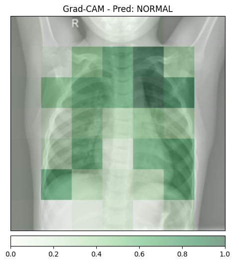
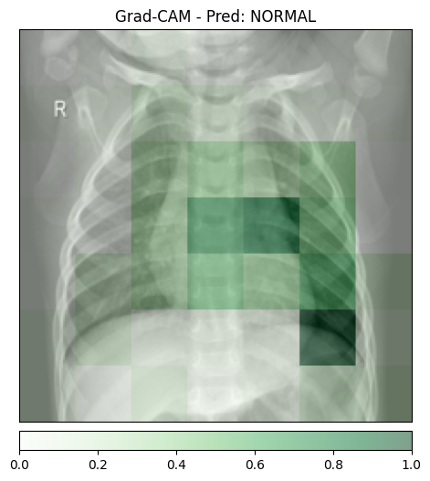
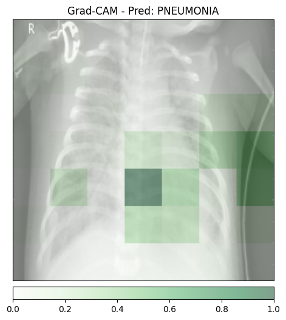
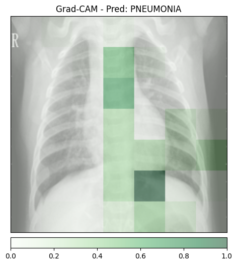
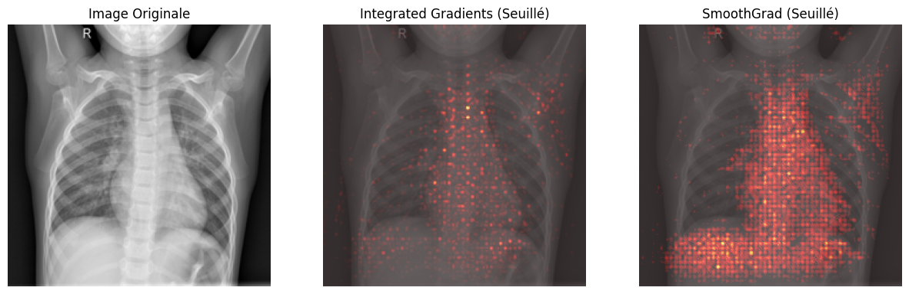

# CI : IA Explicable et Interprétable

Yohan Delière
lien github : https://github.com/lelierre-dev/CSC8608
en local


## Exercice 1 : Mise en place, Inférence et Grad-CAM


```
(.venv312) yohan@neon:~/Documents/TP/CSC8608/TP6$ python 01_gradcam.py normal_1.jpeg
Analyse de l'image : normal_1.jpeg
Temps d'inférence : 0.0047 secondes
Classe prédite : NORMAL
Temps d'explicabilité (Grad-CAM) : 0.0158 secondes
Visualisation sauvegardée dans gradcam_normal_1.png


(.venv312) yohan@neon:~/Documents/TP/CSC8608/TP6$ python 01_gradcam.py normal_2.jpeg
Analyse de l'image : normal_2.jpeg
Temps d'inférence : 0.0048 secondes
Classe prédite : NORMAL
Temps d'explicabilité (Grad-CAM) : 0.0156 secondes
Visualisation sauvegardée dans gradcam_normal_2.png


(.venv312) yohan@neon:~/Documents/TP/CSC8608/TP6$ python 01_gradcam.py pneumo_1.jpeg
Analyse de l'image : pneumo_1.jpeg
Temps d'inférence : 0.0046 secondes
Classe prédite : PNEUMONIA
Temps d'explicabilité (Grad-CAM) : 0.0157 secondes
Visualisation sauvegardée dans gradcam_pneumo_1.png

(.venv312) yohan@neon:~/Documents/TP/CSC8608/TP6$ python 01_gradcam.py pneumo_2.jpeg
Analyse de l'image : pneumo_2.jpeg
Temps d'inférence : 0.0047 secondes
Classe prédite : PNEUMONIA
Temps d'explicabilité (Grad-CAM) : 0.0162 secondes
Visualisation sauvegardée dans gradcam_pneumo_2.png
```







## Exercice 2 : Integrated Gradients et SmoothGrad



```
Temps IG pur : 0.1453s
Temps SmoothGrad (IG x 100) : 6.4986s
Visualisation sauvegardée dans ig_smooth_normal_1.png
```
## Exercice 3 : Modélisation Intrinsèquement Interprétable (Glass-box) sur Données Tabulaires
## Exercice 4 : Explicabilité Post-Hoc avec SHAP sur un Modèle Complexe