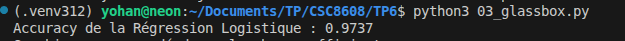
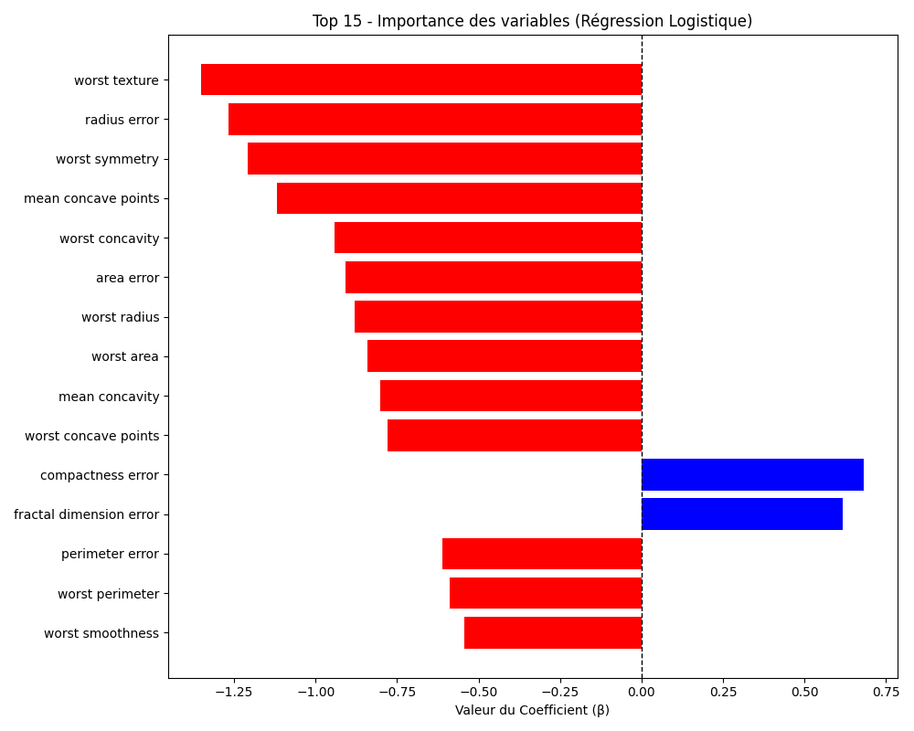
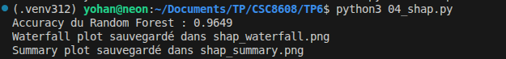
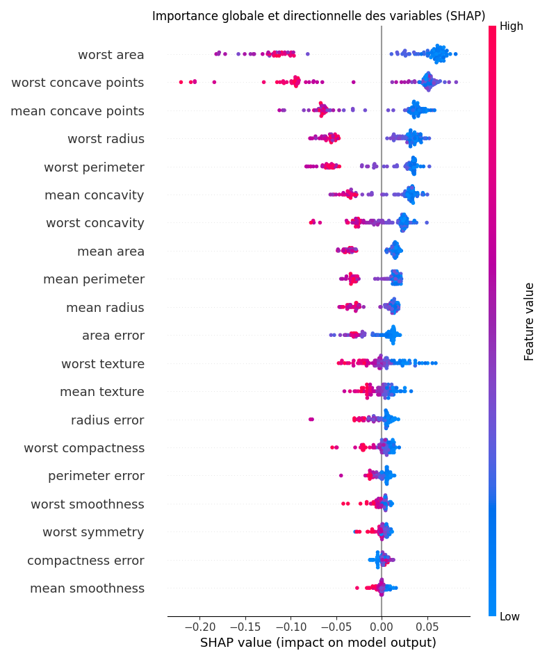

# CI : IA Explicable et Interprétable

Yohan Delière
lien github : https://github.com/lelierre-dev/CSC8608
en local


## Exercice 1 : Mise en place, Inférence et Grad-CAM


```
(.venv312) yohan@neon:~/Documents/TP/CSC8608/TP6$ python 01_gradcam.py normal_1.jpeg
Analyse de l'image : normal_1.jpeg
Temps d'inférence : 0.0047 secondes
Classe prédite : NORMAL
Temps d'explicabilité (Grad-CAM) : 0.0158 secondes
Visualisation sauvegardée dans gradcam_normal_1.png


(.venv312) yohan@neon:~/Documents/TP/CSC8608/TP6$ python 01_gradcam.py normal_2.jpeg
Analyse de l'image : normal_2.jpeg
Temps d'inférence : 0.0048 secondes
Classe prédite : NORMAL
Temps d'explicabilité (Grad-CAM) : 0.0156 secondes
Visualisation sauvegardée dans gradcam_normal_2.png


(.venv312) yohan@neon:~/Documents/TP/CSC8608/TP6$ python 01_gradcam.py pneumo_1.jpeg
Analyse de l'image : pneumo_1.jpeg
Temps d'inférence : 0.0046 secondes
Classe prédite : PNEUMONIA
Temps d'explicabilité (Grad-CAM) : 0.0157 secondes
Visualisation sauvegardée dans gradcam_pneumo_1.png

(.venv312) yohan@neon:~/Documents/TP/CSC8608/TP6$ python 01_gradcam.py pneumo_2.jpeg
Analyse de l'image : pneumo_2.jpeg
Temps d'inférence : 0.0047 secondes
Classe prédite : PNEUMONIA
Temps d'explicabilité (Grad-CAM) : 0.0162 secondes
Visualisation sauvegardée dans gradcam_pneumo_2.png
```


### Analyse des faux positifs

Contrairement à l’énoncé, normal_1.jpeg et normal_2.jpeg sont prédites NORMAL. Pas de faux positif observé ici.

Sur les images normales, GradCAM s’active un peu partout dans le thorax, surtout au niveau des poumons. Le modèle ne cible pas une zone précise, ça reste diffus. On voit aussi des activations sur des zones peu utiles comme les bords ou le centre, donc possible dépendance à des indices de contexte, sans preuve claire de Clever Hans.

Sur les images PNEUMONIA, l’activation est plus présente dans le thorax, mais la localisation reste approximative et déborde parfois vers des zones périphériques.

### Granularité

La heatmap est en gros blocs flous car GradCAM utilise la dernière couche conv du ResNet. À ce niveau, la résolution a déjà été réduite par stride et downsampling, donc la feature map est très petite. Quand on l’agrandit par interpolation, ça donne forcément une explication grossière, pas du pixel par pixel.


## Exercice 2 : Integrated Gradients et SmoothGrad


```
Temps IG pur : 0.1453s
Temps SmoothGrad (IG x 100) : 6.4986s
Visualisation sauvegardée dans ig_smooth_normal_1.png
```


SmoothGrad est beaucoup plus lent qu’une inférence classique. Ici, on passe d’environ 0.005 s pour l’inférence à environ 6.5 s pour SmoothGrad. Pour un premier clic médecin, le faire de manière synchrone serait lent mais pas du tout derangeant avec la machine actuelle de ce tp. Néanmoins avec une machine moins puissante il faudrait adopter une autre strategie.

Une solution simple serait de faire l’inférence immédiatement, d’afficher la prédiction tout de suite, puis de lancer l’explication en arrière plan dans une file de tâches avec un worker GPU, avant de renvoyer la carte dès qu’elle est prête.

L’intérêt d’une carte qui peut descendre sous zéro est qu’elle garde le signe de la contribution. Une valeur positive montre ce qui pousse vers la classe prédite. Une valeur négative montre ce qui va contre cette classe. GradCAM avec ReLU ne garde que le positif, donc on perd une partie de l’information mathématique sur les zones qui freinent la décision.

## Exercice 3 : Modélisation Intrinsèquement Interprétable (Glass-box) sur Données Tabulaires





La variable qui pousse le plus vers la classe "Maligne" est "worst texture", car c’est le coefficient négatif le plus fort.

Les variables les plus importantes visibles ici sont surtout "worst texture", "radius error" et "worst symmetry".

L’avantage d’un modèle directement interprétable est qu’on lit son raisonnement directement dans ses coefficients, sans avoir besoin d’ajouter une méthode d’explication post-hoc qui reste une approximation.

## Exercice 4 : Explicabilité Post-Hoc avec SHAP sur un Modèle Complexe






Sur le Summary Plot SHAP, les variables les plus importantes sont surtout "worst area", "worst concave points" et "mean concave points". Ce ne sont pas exactement les mêmes que pour la régression logistique, qui mettait surtout en avant "worst texture", "radius error" et "worst symmetry".

On en déduit que le classement change selon le modèle, mais qu’on retrouve quand même des biomarqueurs liés à la taille et à la forme de la tumeur. Ces variables ont donc l’air assez robustes médicalement, même si leur importance exacte dépend du modèle utilisé.

Pour le patient 0, la variable qui contribue le plus à tirer la prédiction vers sa valeur finale est "worst area". Sa valeur exacte pour ce patient est 677,9 avec une contribution de +0,07.